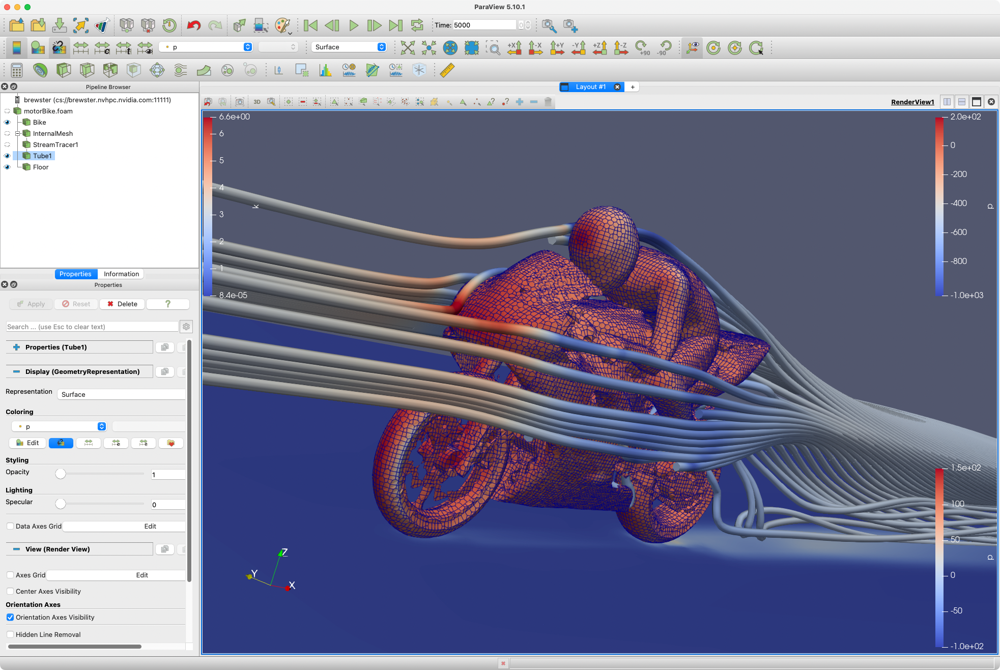

# OpenFOAM with ParaView on Arm64

OpenFOAM is the free, open source CFD software developed primarily by OpenCFD Ltd since 2004. It has a large user base across most areas of engineering and science, from both commercial and academic organisations. OpenFOAM has an extensive range of features to solve anything from complex fluid flows involving chemical reactions, turbulence and heat transfer, to acoustics, solid mechanics and electromagnetics. See https://www.openfoam.com/ for more details.

OpenFOAM is a classic demonstrator of the power of Arm-base HPC systems and has appeared in Arm demos for many years.  In fact, there's no difference between OpenFOAM on Arm64 or any other achirecture, except that Arm-based systems tend to have high memory bandwidth and a high number of CPU cores.  These design features work well with CFD codes, and are especially useful for CFD codes that have not been ported to GPUs.  If your models were developed on a system with low memory bandwidth and few cores, you'll want to update your paramters.

## Running OpenFOAM

These examples assume OpenFOAM has been installed using one of the methods described below, and that the `$FOAM_TUTORIALS` environment variable points to the `tutorials` folder in the OpenFOAM installation.  For example, if you installed OpenFOAM via Spack:

```bash
# One command to load OpenFOAM into your environment and set the FOAM_TUTORIALS environment variable
spack load openfoam+paraview
```

### Quick test: `motorBike` from the OpenFOAM Tutorial

```bash
# Copy the tutorial files to a working directory
cp -a $FOAM_TUTORIALS/incompressible/simpleFoam/motorBike /tmp
cd /tmp/motorBike

# The default decomposition uses only six cores.  Update to use 80 cores for this example
cd system
cp decomposeParDict.6 decomposeParDict.80
# Edit decomposeParDict.80:
diff decomposeParDict.6 decomposeParDict.80
17c17
< numberOfSubdomains 6;
---
> numberOfSubdomains 80;
23c23
<     n           (3 2 1);
---
>     n           (4 5 4);
cd ..

# Update Allrun to use the new decomposition file
# decompDict="-decomposeParDict system/decomposeParDict.80"
sed -i s/decomposeParDict.6/decomposeParDict.80/ Allrun

# Run motorBike on 80 MPI ranks
./Allrun
```

### Benchmark: HPC `motorBike` 

The HPC modification of motorbike tutorial is developed from the well known motorbike tutorial:
 - The mesh generated from blockMesh is 3 times finer, along each axis, with respect to the tutorial one.  
 - The base mesh (size S) is about 8.6*10^6 cells (the tutorial one is 3.2*10^5)
 - Comes in three sizes according to the number of cells: 
   - L (34M)
   - M (17.2M)
   - S (8.6M)

For OpenFOAM v2212, we'll update the system files to use the GAMG solver with GaussSeidel smoother, and to take advantage of high CPU core counts.

```bash
# Download input files
git clone https://develop.openfoam.com/committees/hpc.git

# Pick a test case size, e.g. "Small"
cd hpc/HPC_motorbike/Small/v1912
```

Update `system/decomposeParDict` to set the number of parallel subdomains.  For example, make these changes to use 64 CPU cores:
```diff
--- a/HPC_motorbike/Small/v1912/system/decomposeParDict
+++ b/HPC_motorbike/Small/v1912/system/decomposeParDict
@@ -15,7 +15,7 @@ FoamFile

 // * * * * * * * * * * * * * * * * * * * * * * * * * * * * * * * * * * * * * //

-numberOfSubdomains 16;
+numberOfSubdomains 64;

 //method          hierarchical;
 method          scotch;
@@ -28,7 +28,7 @@ simpleCoeffs

 hierarchicalCoeffs
 {
-    n               (4 4 1);
+    n               (4 4 4);
     delta           0.001;
     order           xyz;
 }
```

Also update `system/fvSolution` to use the GAMG solver with GaussSeidel smoother:
```diff
--- a/HPC_motorbike/Small/v1912/system/fvSolution
+++ b/HPC_motorbike/Small/v1912/system/fvSolution
@@ -18,8 +18,8 @@ solvers
 {
     p
     {
-        solver          PCG;
-        preconditioner  DIC;
+        solver          GAMG;
+        smoother        GaussSeidel;
         tolerance       1e-7;
         relTol          0.01;
     }
```

Optionally, reduce `endTime` in `system/controlDict` for a quicker run:
```diff
--- a/HPC_motorbike/Small/v1912/system/controlDict
+++ b/HPC_motorbike/Small/v1912/system/controlDict
@@ -22,7 +22,7 @@ startTime       0;

 stopAt          endTime;

-endTime         500;
+endTime         10;

 deltaT          1;
```

Build the mesh and run:
```bash
./AllmeshS
./Allrun
```

### Visualize with ParaView

You can use ParaView's client/server capabilities to visualize remote datasets.  This is usually a good approach if you're working on the NVIDIA Arm HPC DevKit.

```bash
# Note: make sure to load the ParaView version that matches your locally installed version.  You may need to `spack install` the appropriate version, e.g. `spack install -j80 paraview@5.10.1`
spack load paraview@5.10.1

# Start the ParaView server in the directory containing the OpenFOAM data.  For example:
cd /tmp/motorBike
touch motorBike.foam
pvserver
```
From there on, it's all ParaView as normal, exactly like any other system.  This rendering was done by running ParaView on an Arm-based Apple M1 MacBook Pro connecting to a ParaView server running on an NVIDIA Arm HPC DevKit.  Have fun!




## Installing from source

OpenFOAM and ParaView install simply and easily on Arm64 via Spack.

1. Recommended but optional: use the latest GCC from Spack.  You may be able to use other compilers, but this is known to work well.
```bash
git clone https://github.com/spack/spack.git
# 
spack install gcc+binutils+piclibs
# Add the new GCC installation to your environment
spack load gcc
# Update Spack's compiler configuration
spack compiler find
```

2. Install OpenFOAM with ParaView support.  Heads up, this will build and install a lot of packages and may take several hours.
```bash
spack install -j80 paraview@5.10.1 %gcc@12.1.0
spack install -j80 openfoam+paraview %gcc@12.1.0
```
For example:
```
jlinford@brewster:~$ spack install -j80 openfoam+paraview %gcc@12.1.0
[+] /data/jlinford/spack/opt/spack/linux-ubuntu20.04-graviton2/gcc-12.1.0/gnuconfig-2021-08-14-alei77siau7bvt6d42262xb3edviuspx
[+] /data/jlinford/spack/opt/spack/linux-ubuntu20.04-graviton2/gcc-12.1.0/ca-certificates-mozilla-2022-03-29-hh3w4wigz2xjhdcsf36va6cavnfyyyjj
[+] /data/jlinford/spack/opt/spack/linux-ubuntu20.04-graviton2/gcc-12.1.0/zlib-1.2.12-tump2fswkafbpbnmij7vk57tfrtakox5
[+] /data/jlinford/spack/opt/spack/linux-ubuntu20.04-graviton2/gcc-12.1.0/lz4-1.9.3-mua6zke3vxktgdv2dqqsa2ok2qgpridz
[+] /data/jlinford/spack/opt/spack/linux-ubuntu20.04-graviton2/gcc-12.1.0/zstd-1.5.2-4q5wsyqhekzomonk72vojza7jol4trnz
[+] /data/jlinford/spack/opt/spack/linux-ubuntu20.04-graviton2/gcc-12.1.0/nasm-2.15.05-c75juukinexzgbuvb72vuortvec4bp2w
[+] /data/jlinford/spack/opt/spack/linux-ubuntu20.04-graviton2/gcc-12.1.0/libsigsegv-2.13-m4tdps7ujinks3m7mvnhcbmsfwozg6kw
[+] /data/jlinford/spack/opt/spack/linux-ubuntu20.04-graviton2/gcc-12.1.0/libunwind-1.6.2-g7gakuqwf6lv2tbdja24d7la62cgqcyo
[+] /data/jlinford/spack/opt/spack/linux-ubuntu20.04-graviton2/gcc-12.1.0/pcre-8.45-dvbb7uunwnufdftee4zltfsxv552r36s
[+] /data/jlinford/spack/opt/spack/linux-ubuntu20.04-graviton2/gcc-12.1.0/autoconf-archive-2022.02.11-o5l4yz65744p4qzbikcaatymj2rqz2qs
[+] /data/jlinford/spack/opt/spack/linux-ubuntu20.04-graviton2/gcc-12.1.0/util-macros-1.19.3-r5turtmg7cfru353yl2qjtm7n56fd3vs
[+] /data/jlinford/spack/opt/spack/linux-ubuntu20.04-graviton2/gcc-12.1.0/findutils-4.9.0-4jm3iap3pgjdhxcde72tnlsq2wivzckp
[+] /data/jlinford/spack/opt/spack/linux-ubuntu20.04-graviton2/gcc-12.1.0/libmd-1.0.4-a5dm26mer4vpokwan4nbp72hszenbo2h
[+] /data/jlinford/spack/opt/spack/linux-ubuntu20.04-graviton2/gcc-12.1.0/libffi-3.4.2-47d4fjz4tpx6qjzh7ukucwqwyluljpnf
[+] /data/jlinford/spack/opt/spack/linux-ubuntu20.04-graviton2/gcc-12.1.0/xcb-proto-1.14.1-53rylaloje6kc3fun3tkdnrrxryzvznr
[+] /data/jlinford/spack/opt/spack/linux-ubuntu20.04-graviton2/gcc-12.1.0/xz-5.2.5-nw2ffvdzqlsq4rt3hpwkqvs4h2mmiml6
[+] /data/jlinford/spack/opt/spack/linux-ubuntu20.04-graviton2/gcc-12.1.0/libogg-1.3.5-ehjnzxfjwblgxdgrzpxade3tjqtvgi24
[+] /data/jlinford/spack/opt/spack/linux-ubuntu20.04-graviton2/gcc-12.1.0/berkeley-db-18.1.40-yslfqjndlwl22mtp3ymrgpuhlh6yoc7e
[+] /data/jlinford/spack/opt/spack/linux-ubuntu20.04-graviton2/gcc-12.1.0/libtiff-4.4.0-gq2mqdoa6znmw6thmmcyt6wvhdtegrl3
[+] /data/jlinford/spack/opt/spack/linux-ubuntu20.04-graviton2/gcc-12.1.0/libfabric-1.14.1-lafbv5lc73rhhn6m54mf7mytj4w6frx5
[+] /data/jlinford/spack/opt/spack/linux-ubuntu20.04-graviton2/gcc-12.1.0/libpthread-stubs-0.4-z2zmzk6q64picboyza3lxtymal5y2r65
[+] /data/jlinford/spack/opt/spack/linux-ubuntu20.04-graviton2/gcc-12.1.0/libiconv-1.16-odrhinzlxzprotvsxt23o6kzlypsvc3v
[+] /data/jlinford/spack/opt/spack/linux-ubuntu20.04-graviton2/gcc-12.1.0/pkgconf-1.8.0-dal7j4uoy7uatwum5yn7e33ykrfqgltk
[+] /data/jlinford/spack/opt/spack/linux-ubuntu20.04-graviton2/gcc-12.1.0/pigz-2.7-xm364sh2hbr5lxnencb5xl3gbyrs4rqc
[+] /data/jlinford/spack/opt/spack/linux-ubuntu20.04-graviton2/gcc-12.1.0/libpng-1.6.37-e2d2myhjk4zi5b5yjulgb3odll26ptir
[+] /data/jlinford/spack/opt/spack/linux-ubuntu20.04-graviton2/gcc-12.1.0/libbsd-0.11.5-lifwmfy35f5uiymdenloffhbleqtszag
[+] /data/jlinford/spack/opt/spack/linux-ubuntu20.04-graviton2/gcc-12.1.0/diffutils-3.8-eesln7iyiqxtwfm3ettzzdqgjkiohzwq
[+] /data/jlinford/spack/opt/spack/linux-ubuntu20.04-graviton2/gcc-12.1.0/ncurses-6.2-kgpllxmuxnu4v6zcb4bjg45wgdnns3dd
[+] /data/jlinford/spack/opt/spack/linux-ubuntu20.04-graviton2/gcc-12.1.0/xproto-7.0.31-cgvyfr756t6non72cfh54nztyzmr6d4z
[+] /data/jlinford/spack/opt/spack/linux-ubuntu20.04-graviton2/gcc-12.1.0/renderproto-0.11.1-yzf75ipsuqobjo6xqbhrh3n5o6achdha
[+] /data/jlinford/spack/opt/spack/linux-ubuntu20.04-graviton2/gcc-12.1.0/xtrans-1.3.5-rgxuxsayz34fxzxdv2xv5yw3t4d5ybey
[+] /data/jlinford/spack/opt/spack/linux-ubuntu20.04-graviton2/gcc-12.1.0/kbproto-1.0.7-adm6kklhuyxaq2c3b4lq6a6way762o7f
[+] /data/jlinford/spack/opt/spack/linux-ubuntu20.04-graviton2/gcc-12.1.0/util-linux-uuid-2.37.4-ya77qcheyson3oojxyjcalhmotni76px
[+] /data/jlinford/spack/opt/spack/linux-ubuntu20.04-graviton2/gcc-12.1.0/inputproto-2.3.2-cogkw7fwfhzd7drbxfposob7vo5v6e3o
[+] /data/jlinford/spack/opt/spack/linux-ubuntu20.04-graviton2/gcc-12.1.0/randrproto-1.5.0-x4lehy22k3eumbkrp5nvo4d22e5onate
[+] /data/jlinford/spack/opt/spack/linux-ubuntu20.04-graviton2/gcc-12.1.0/libxml2-2.9.13-4mv4n2g3333to6wusf3qjkio2ataw3v5
[+] /data/jlinford/spack/opt/spack/linux-ubuntu20.04-graviton2/gcc-12.1.0/xextproto-7.3.0-2qzni2wg3vkqtit3jmekwa4rqd2cqp7f
[+] /data/jlinford/spack/opt/spack/linux-ubuntu20.04-graviton2/gcc-12.1.0/glproto-1.4.17-jjhllhimkz22rusef2a6kwjyxxgzwnza
[+] /data/jlinford/spack/opt/spack/linux-ubuntu20.04-graviton2/gcc-12.1.0/expat-2.4.8-qut3edceibtfchdi3wv2l6puu7tcou3o
[+] /data/jlinford/spack/opt/spack/linux-ubuntu20.04-graviton2/gcc-12.1.0/m4-1.4.19-gn5xsetwjr25ex564cn4f4vm557naxz4
[+] /data/jlinford/spack/opt/spack/linux-ubuntu20.04-graviton2/gcc-12.1.0/bzip2-1.0.8-a4wa3fgtrf24hcpgsl5nuex6om25s2lc
[+] /data/jlinford/spack/opt/spack/linux-ubuntu20.04-graviton2/gcc-12.1.0/readline-8.1.2-4q33rc7ke4ijpay2wnejvvswwpbtk4g5
[+] /data/jlinford/spack/opt/spack/linux-ubuntu20.04-graviton2/gcc-12.1.0/libedit-3.1-20210216-7d26dlsv7xt5mfc6dvpve26slbdkedwx
[+] /data/jlinford/spack/opt/spack/linux-ubuntu20.04-graviton2/gcc-12.1.0/libxau-1.0.8-gmj4qzc34h3ryduwzphxoiw3gesay22o
[+] /data/jlinford/spack/opt/spack/linux-ubuntu20.04-graviton2/gcc-12.1.0/libxdmcp-1.1.2-4aob3k47yo4crw3wy2xt3nvunkok3emu
[+] /data/jlinford/spack/opt/spack/linux-ubuntu20.04-graviton2/gcc-12.1.0/libice-1.0.9-dume2i7avzto24kidu5agadag4nyzphj
[+] /data/jlinford/spack/opt/spack/linux-ubuntu20.04-graviton2/gcc-12.1.0/libtool-2.4.7-vycggas4odlocnsug553wwlryi3edc6w
[+] /data/jlinford/spack/opt/spack/linux-ubuntu20.04-graviton2/gcc-12.1.0/freetype-2.11.1-flcoarmm2eozwkbeolm7tkgrbrjqgy2d
[+] /data/jlinford/spack/opt/spack/linux-ubuntu20.04-graviton2/gcc-12.1.0/tar-1.34-fq6dhalo6ngeqcinnk2zqnhzqanux7xl
[+] /data/jlinford/spack/opt/spack/linux-ubuntu20.04-graviton2/gcc-12.1.0/boost-1.79.0-q3ikehaxpft4nsveb2siqxczj4iavobs
[+] /data/jlinford/spack/opt/spack/linux-ubuntu20.04-graviton2/gcc-12.1.0/sqlite-3.38.5-gpum2eyg32xlcztxct4lzmgg7xkq457s
[+] /data/jlinford/spack/opt/spack/linux-ubuntu20.04-graviton2/gcc-12.1.0/gdbm-1.19-dtebszyt3g2enwe33wa3uqvziqgnkq6l
[+] /data/jlinford/spack/opt/spack/linux-ubuntu20.04-graviton2/gcc-12.1.0/libxcb-1.14-tzlaubx2fluq7zgarinr5q25c53bevkr
[+] /data/jlinford/spack/opt/spack/linux-ubuntu20.04-graviton2/gcc-12.1.0/libsm-1.2.3-cjera2rvzgwhi7isafl4bv7zhdnebfzh
[+] /data/jlinford/spack/opt/spack/linux-ubuntu20.04-graviton2/gcc-12.1.0/libpciaccess-0.16-3z5md4tmd2vs3srz6ick3jjzkqidm5vo
[+] /data/jlinford/spack/opt/spack/linux-ubuntu20.04-graviton2/gcc-12.1.0/gettext-0.21-petcdyuyihrfqbshcvwgdeyh7ti2aonk
[+] /data/jlinford/spack/opt/spack/linux-ubuntu20.04-graviton2/gcc-12.1.0/perl-5.34.1-axypvtjnjftifw5gzorlrxkujjzexwzs
[+] /data/jlinford/spack/opt/spack/linux-ubuntu20.04-graviton2/gcc-12.1.0/hwloc-2.7.1-m5jwahzssd4fu4fvghoaqw7sk4gudtq5
[+] /data/jlinford/spack/opt/spack/linux-ubuntu20.04-graviton2/gcc-12.1.0/binutils-2.38-vzhvenclh7etkqwc56kpsnkaufbshvhm
[+] /data/jlinford/spack/opt/spack/linux-ubuntu20.04-graviton2/gcc-12.1.0/openssl-1.1.1q-ipmqn4ybefdka27tzd5uxpxizm34u4dn
[+] /data/jlinford/spack/opt/spack/linux-ubuntu20.04-graviton2/gcc-12.1.0/autoconf-2.69-fcg77v5m5r5aa7nsspmhtqin3z2bbqsv
[+] /data/jlinford/spack/opt/spack/linux-ubuntu20.04-graviton2/gcc-12.1.0/bison-3.8.2-cwtaqc47uorto75d53vvbmknxyfsjx3b
[+] /data/jlinford/spack/opt/spack/linux-ubuntu20.04-graviton2/gcc-12.1.0/perl-data-dumper-2.173-ckve77odzlirssnz3ygvaekpucogrwtp
[+] /data/jlinford/spack/opt/spack/linux-ubuntu20.04-graviton2/gcc-12.1.0/texinfo-6.5-xpngfugzehds73azgnpnvcua74d3p7ag
[+] /data/jlinford/spack/opt/spack/linux-ubuntu20.04-graviton2/gcc-12.1.0/help2man-1.47.16-4l4a5plcr422uerc7yb6ptysqa4mde3u
[+] /data/jlinford/spack/opt/spack/linux-ubuntu20.04-graviton2/gcc-12.1.0/libx11-1.7.0-iw5bhjup2hgghz4cko2wxs7odd5t54vu
[+] /data/jlinford/spack/opt/spack/linux-ubuntu20.04-graviton2/gcc-12.1.0/cmake-3.23.2-5nbw6l46chq7phimildb5xab7h7sklhf
[+] /data/jlinford/spack/opt/spack/linux-ubuntu20.04-graviton2/gcc-12.1.0/python-3.9.13-qwutfub2bwdlk5cylsak6e5qjdismyo7
[+] /data/jlinford/spack/opt/spack/linux-ubuntu20.04-graviton2/gcc-12.1.0/libevent-2.1.12-onfetncot4kdgdltxkfg3kpufvqpljgx
[+] /data/jlinford/spack/opt/spack/linux-ubuntu20.04-graviton2/gcc-12.1.0/automake-1.16.5-shjoajyj5zyv3gibxqxsudc223el4bcj
[+] /data/jlinford/spack/opt/spack/linux-ubuntu20.04-graviton2/gcc-12.1.0/krb5-1.19.3-hztemg5jn7ugdfrjd2kg7pnzm5hmsypj
[+] /data/jlinford/spack/opt/spack/linux-ubuntu20.04-graviton2/gcc-12.1.0/libxt-1.1.5-nys6tsognwkldjxrc7vrvybkaezdp5fa
[+] /data/jlinford/spack/opt/spack/linux-ubuntu20.04-graviton2/gcc-12.1.0/libxrender-0.9.10-vlvvdiqaqc23zuoo5ldqntn6yq77dhtv
[+] /data/jlinford/spack/opt/spack/linux-ubuntu20.04-graviton2/gcc-12.1.0/libxext-1.3.3-3jlimam55c7hsinpfbwkgayogsdgb3wq
[+] /data/jlinford/spack/opt/spack/linux-ubuntu20.04-graviton2/gcc-12.1.0/protobuf-21.1-oe2zjgefz2trxwwma4qe6wcpckntaozf
[+] /data/jlinford/spack/opt/spack/linux-ubuntu20.04-graviton2/gcc-12.1.0/zfp-0.5.5-5omz7y2rzr7yktdjtxv2ijpwjq7ysud5
[+] /data/jlinford/spack/opt/spack/linux-ubuntu20.04-graviton2/gcc-12.1.0/eigen-3.4.0-e6oy2dopfogmcs4uibtkbtpwxe7sg3wl
[+] /data/jlinford/spack/opt/spack/linux-ubuntu20.04-graviton2/gcc-12.1.0/jsoncpp-1.9.4-ugvz4i2r3r5bhmw7zv7ysy3h7sxcb3f3
[+] /data/jlinford/spack/opt/spack/linux-ubuntu20.04-graviton2/gcc-12.1.0/pugixml-1.11.4-vldtt474ibhyurp46dkzcfdgylr4bopx
[+] /data/jlinford/spack/opt/spack/linux-ubuntu20.04-graviton2/gcc-12.1.0/snappy-1.1.9-bnegbcey67kruchs5uqspjtaufq3ytqh
[+] /data/jlinford/spack/opt/spack/linux-ubuntu20.04-graviton2/gcc-12.1.0/sz-2.1.12.2-3f4vvv7z7siql63gce2kohjvjgirs6id
[+] /data/jlinford/spack/opt/spack/linux-ubuntu20.04-graviton2/gcc-12.1.0/pegtl-3.2.0-74ymqylkjcpzby4kvp62nwz7dcfk7ptz
[+] /data/jlinford/spack/opt/spack/linux-ubuntu20.04-graviton2/gcc-12.1.0/double-conversion-3.1.5-wpebobqbgfgthzeyaj2ombrss7vithbt
[+] /data/jlinford/spack/opt/spack/linux-ubuntu20.04-graviton2/gcc-12.1.0/libjpeg-turbo-2.1.3-m24ocgfv6yymaudejy3kd5yiujzf52kz
[+] /data/jlinford/spack/opt/spack/linux-ubuntu20.04-graviton2/gcc-12.1.0/ninja-1.11.0-2np2yn24zfahudozotw5itlbait5zqld
[+] /data/jlinford/spack/opt/spack/linux-ubuntu20.04-graviton2/gcc-12.1.0/py-pip-22.1.2-ikibzjwimpnfypjzvnoat3u6jbcak75x
[+] /data/jlinford/spack/opt/spack/linux-ubuntu20.04-graviton2/gcc-12.1.0/pmix-4.1.2-fbko3zrubp5bca6sjnaht67r7acaot2w
[+] /data/jlinford/spack/opt/spack/linux-ubuntu20.04-graviton2/gcc-12.1.0/libtheora-1.1.1-7bpdb5kdzt47iwjnwntru46so6y5lfor
[+] /data/jlinford/spack/opt/spack/linux-ubuntu20.04-graviton2/gcc-12.1.0/flex-2.6.4-spr7ygeus3s4uqazcdikr72ox42rvvat
[+] /data/jlinford/spack/opt/spack/linux-ubuntu20.04-graviton2/gcc-12.1.0/numactl-2.0.14-qxgjy6mzewazvhsmqz2bvkpstrowmro3
[+] /data/jlinford/spack/opt/spack/linux-ubuntu20.04-graviton2/gcc-12.1.0/gmp-6.2.1-cirle4ccyseisyc62yw2zd2zr4uvzvly
[+] /data/jlinford/spack/opt/spack/linux-ubuntu20.04-graviton2/gcc-12.1.0/swig-4.0.2-ero2kxp5ukbxbvx4zszcbuk7zbgbk5c3
[+] /data/jlinford/spack/opt/spack/linux-ubuntu20.04-graviton2/gcc-12.1.0/openssh-9.0p1-xxmpvh6yc5dubf4amrosdxhx7uqrnsm4
[+] /data/jlinford/spack/opt/spack/linux-ubuntu20.04-graviton2/gcc-12.1.0/libxrandr-1.5.0-mjkcd32syschacnhvqrueu4bgfc35goa
[+] /data/jlinford/spack/opt/spack/linux-ubuntu20.04-graviton2/gcc-12.1.0/c-blosc-1.21.1-o7bv4ntv3sfaqwwcnkwd5lk24nbj2qfr
[+] /data/jlinford/spack/opt/spack/linux-ubuntu20.04-graviton2/gcc-12.1.0/py-wheel-0.37.0-uvmua7vzj6q2k63i5e7ffmhi5lpiecit
[+] /data/jlinford/spack/opt/spack/linux-ubuntu20.04-graviton2/gcc-12.1.0/py-setuptools-63.0.0-rflutdz2l5rpwqtuubhmyko2jevpglp4
[+] /data/jlinford/spack/opt/spack/linux-ubuntu20.04-graviton2/gcc-12.1.0/mpfr-4.1.0-al3vvfbhqrvdbv4q2my5hzufr4ik3nnx
[+] /data/jlinford/spack/opt/spack/linux-ubuntu20.04-graviton2/gcc-12.1.0/llvm-14.0.6-dwkfzaa6v3gemzhvib66kvqe2sqpshu6
[+] /data/jlinford/spack/opt/spack/linux-ubuntu20.04-graviton2/gcc-12.1.0/openmpi-4.1.4-knhl2prbthp2jze7lkgb7wg7dowdnw3g
[+] /data/jlinford/spack/opt/spack/linux-ubuntu20.04-graviton2/gcc-12.1.0/xrandr-1.5.0-26km5x3bmzynaykwintxqftcj5vtdvgm
[+] /data/jlinford/spack/opt/spack/linux-ubuntu20.04-graviton2/gcc-12.1.0/py-markupsafe-2.0.1-txh4amqy6w34rjdkmo3zadk7bcwmoaxc
[+] /data/jlinford/spack/opt/spack/linux-ubuntu20.04-graviton2/gcc-12.1.0/meson-0.62.2-zqyjj7k7g4fzjbai3o3ozke2fw3rvg42
[+] /data/jlinford/spack/opt/spack/linux-ubuntu20.04-graviton2/gcc-12.1.0/cgal-4.13-zqhdobfk7eli6dl6dn2lx35r7ck7vm3q
[+] /data/jlinford/spack/opt/spack/linux-ubuntu20.04-graviton2/gcc-12.1.0/scotch-7.0.1-5w4mil2ao6ymm37irx2j5nral3kevgji
[+] /data/jlinford/spack/opt/spack/linux-ubuntu20.04-graviton2/gcc-12.1.0/hdf5-1.12.2-szhrzmf4wkuju5v54cf4je3xxza52q6v
[+] /data/jlinford/spack/opt/spack/linux-ubuntu20.04-graviton2/gcc-12.1.0/adios2-2.8.2-kduyd7wohyuseit3s4qv6q36mmvpnw4p
[+] /data/jlinford/spack/opt/spack/linux-ubuntu20.04-graviton2/gcc-12.1.0/fftw-3.3.10-6fjghqss7dkyx6vitgkaawlxdtiy7xd3
[+] /data/jlinford/spack/opt/spack/linux-ubuntu20.04-graviton2/gcc-12.1.0/py-mako-1.1.6-ayqj4p7xpc7oxuwsacnbjq5gsf6lm4td
[+] /data/jlinford/spack/opt/spack/linux-ubuntu20.04-graviton2/gcc-12.1.0/netcdf-c-4.8.1-u2wl5rufrawndi5ymx47tkuqlddbgwfo
[+] /data/jlinford/spack/opt/spack/linux-ubuntu20.04-graviton2/gcc-12.1.0/mesa-22.0.2-enf2ch2kwejtc6wzdx64oi7vp4u4ehay
[+] /data/jlinford/spack/opt/spack/linux-ubuntu20.04-graviton2/gcc-12.1.0/paraview-5.9.1-fdenckz5nssyk6apqon3nuhhvgcabr2l
==> Installing openfoam-2206-r3ougjvuclnazmb3cgsiqrixsf2uej3b
==> No binary for openfoam-2206-r3ougjvuclnazmb3cgsiqrixsf2uej3b found: installing from source
==> Fetching https://sourceforge.net/projects/openfoam/files/v2206/OpenFOAM-v2206.tgz
==> Added file spack-Allwmake
==> Added file README-spack
==> Ran patch() for openfoam
==> openfoam: Executing phase: 'configure'
==> openfoam: Executing phase: 'build'
==> openfoam: Executing phase: 'install'
==> openfoam: Successfully installed openfoam-2206-r3ougjvuclnazmb3cgsiqrixsf2uej3b
  Fetch: 18.98s.  Build: 59m 25.71s.  Total: 59m 44.69s.
[+] /data/jlinford/spack/opt/spack/linux-ubuntu20.04-graviton2/gcc-12.1.0/openfoam-2206-r3ougjvuclnazmb3cgsiqrixsf2uej3b
```

## Building from source without Spack and minimal dependendencies

If you'd like to minimize OpenFOAM compilation time you can build directly from source without Spack and only enable a minimal feature set.

Requirements:
 * GMP development files, e.g. `dnf install gmp-devel` or `apt install libgmp-dev`
 * MPFR development files, e.g. `dnf install mpfr-devel` or `apt install libmpfr-dev`
 * Flex development files, e.g. `dnf install flex-devel` or `apt install libfl-dev`
 * CMake 3.10 or higher.  Latest version recommended.
 * GCC 11.2 or higher.  Latest version recommended.
 * OpenMPI 4.1.4 built with GCC.

```bash
# Note: The OpenFOAM build system needs $BUILD_DIR to be set
export BUILD_DIR=$PWD/OpenFOAM
mkdir -p $BUILD_DIR
cd $BUILD_DIR

# Download source
wget https://sourceforge.net/projects/openfoam/files/v2212/OpenFOAM-v2212.tgz
wget https://sourceforge.net/projects/openfoam/files/v2212/ThirdParty-v2212.tgz

# Unpack source
tar xvzf OpenFOAM-v2212.tgz
tar xvzf ThirdParty-v2212.tgz
cd OpenFOAM-v2212

# Update compiler flags to tune for local CPU arch
# This enables SVE2 auto-vectorization and LSE atomics, among other things
sed -i -e 's/-O3/-mcpu=native -O3/' wmake/rules/linuxARM64Gcc/*

# Initialize build environment
source etc/bashrc

# Compile WRF and all third party packages
time ./Allwmake -j -s -q -l
```
